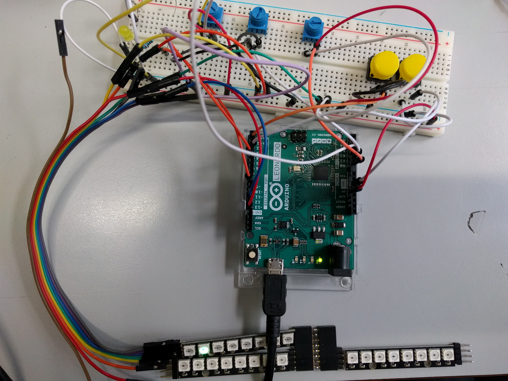
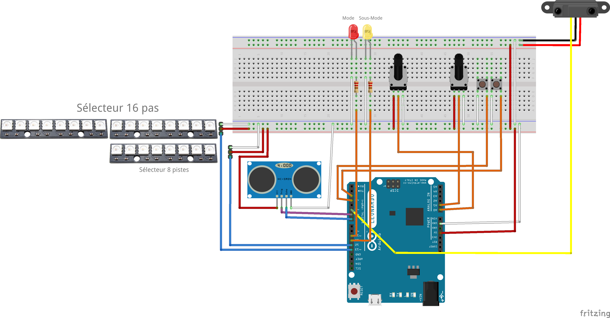
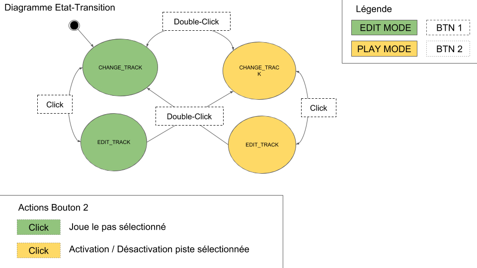

# MIDUINO SEQUENCEUR

### Bibliothèques

* [AceButton](https://github.com/bxparks/AceButton)
* [NeoPixel](https://github.com/adafruit/Adafruit_NeoPixel)
* [MidiUSB](https://www.arduino.cc/en/Reference/MIDIUSB)

### Capteurs / Actionneurs

* [RGB 8xLed Strip](https://www.amazon.com/Strip-CJMCU-WS2812-Driver-Development/dp/B071G8WQ8T)
* [Trimpot 10K with Knob](https://www.sparkfun.com/products/9806)
* [UltraSound Range Finder DPY-ME007](http://forum.arduino.cc/index.php?topic=63302.0)
* [Capteur Infrarouge réglable MC005](https://www.gotronic.fr/art-capteur-infrarouge-reglable-mc005-12405.htm)
* Trackpad
  * https://create.arduino.cc/projecthub/BuildItDR/arduino-controlled-usb-trackpad-f443a6
  * https://playground.arduino.cc/ComponentLib/Ps2mouse

### TODO

* Midi Clock

## Fonctionalités ##

  - Configuration de séquence musical sur deux mesures (binaire)
  - Choix des notes pour chaque temps
  - Gestion du multiTrack (8 channel disponible)
  - Gestion du bouton Play/Pause (capteur d'obstacle)
  - Gestion de filtre audio (capteur de distance)
  - Envoi de signaux MIDI par USB  

## Montage ##

  

## MODE ##

  Le système est composé de deux modes (**PLAY** et **EDIT**) ainsi que de deux sous modes (**CHANGE_TRACK** et **EDIT_TRACK**)

  

  **PLAY**: Permet de jouer toutes les tracks  
  **EDIT**: Permet l'édition d'une track  
  **CHANGE_TRACK**: Permet de sélectionner une track  
  **EDIT_TRACK** PErmet d'étiter une track  

  Le système inclut aussi deux potentiomètres qui permettent de se déplacer au niveau des track ou des temps ainsi que de choisir la note à jouer en fonction du mode sélectioné.
